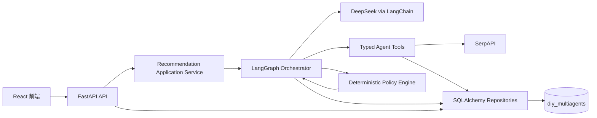
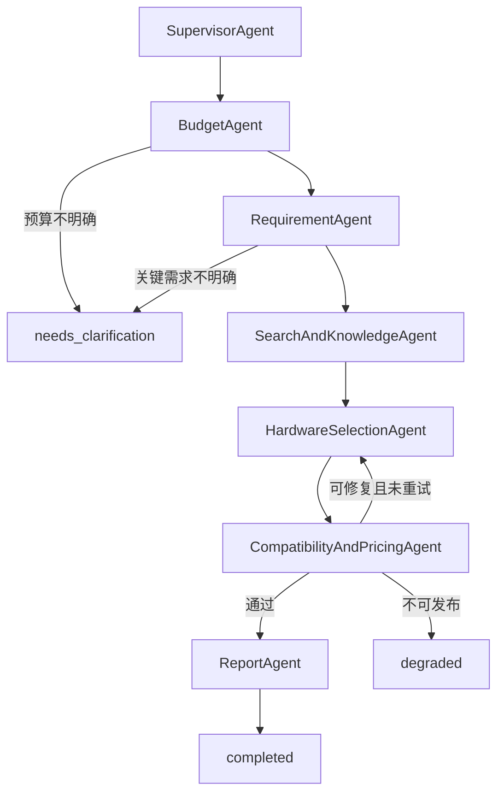

# 可信多 Agent 与 MySQL 持久化架构设计

## 1. 背景与目标

当前项目已经具备 FastAPI、React、LangChain、LangGraph 和七个界面节点，但运行链路仍存在几个根本问题：

- 大模型生成的配件型号、价格和规格会直接进入兼容性与预算校验，缺少独立事实来源。
- 兼容性校验在规格缺失时可能错误通过。
- Agent 的规划和反思结果主要用于展示，没有真正控制图的分支、重试和发布。
- 任务、结果、Agent 运行和工具调用只存在内存中，服务重启后丢失。
- MySQL 配置、ORM 和 SQL 文件存在，但运行时仍使用内存仓储。
- 前端会显示演示结果、静态指标或不完整 trace，容易让用户误以为真实任务已经完成。
- 部分接口、中文预算解析、安全边界和测试入口存在缺陷。

本次改造的目标是建立一个可追踪、可恢复、不可伪造通过的本地多 Agent 推荐系统：

1. 七个 Agent 节点都由大模型参与核心判断，但模型不能单独决定价格、规格和发布资格。
2. 所有配件事实必须来自结构化目录或可追踪的价格证据。
3. 预算、兼容性、功耗和证据完整性由确定性规则作最终裁决。
4. 任务、结果、Agent 调用、工具调用和证据写入独立 MySQL 数据库。
5. 前端只展示真实任务状态、真实结果和可审计轨迹，不展示伪造进度或默认推荐。
6. 不通过穷举用户表达、型号或价格实现业务逻辑。

## 2. 范围与非目标

### 2.1 本次范围

- 新建独立数据库 `diy_multiagents`。
- 使用 SQLAlchemy 仓储和 Alembic 迁移管理数据库结构。
- 持久化推荐任务、最终结果、Agent 运行、工具调用、配件目录、价格证据和方案配件。
- 重构 LangGraph 状态和节点，使规划、工具选择、反思、重试和降级真正影响执行。
- 修复预算解析、兼容性 fail-open、低预算绕过、接口依赖、密钥泄漏、健康检查和客户端生命周期。
- 保留现有前端视觉设计，只修正数据来源、交互状态、trace 和测试。
- 增加后端单元测试、图测试、API 测试、MySQL 集成测试和可执行前端测试。

### 2.2 非目标

- 不引入 Redis、Celery、Qdrant 或 RAG。
- 不部署公网域名，不处理多机分布式调度。
- 不自动抓取电商站点绕过登录、验证码或反爬限制。
- 不承诺进程崩溃后自动恢复正在执行到一半的外部模型调用；服务重启后将未完成任务标记为可解释的中断状态。
- 不重新设计前端品牌、排版和页面结构。

## 3. 设计原则

### 3.1 AI 负责推理，工具负责事实

模型可以：

- 解释需求、识别约束和不确定项。
- 制定搜索与选型策略。
- 提出候选配件和替代方向。
- 阅读工具返回的事实并进行取舍。
- 反思失败原因并给出下一次执行指令。
- 整理已通过校验的报告。

模型不可以：

- 把自己生成的价格当成事实。
- 把自己生成的接口、尺寸、功耗当成已验证规格。
- 覆盖确定性预算解析器已经确定的金额。
- 覆盖兼容性、证据完整性和发布资格校验。
- 在缺少证据时生成“全部通过”。

### 3.2 不写死的边界

禁止在 Python 或前端源码中维护：

- 固定配件型号清单。
- 固定型号价格。
- 针对某个品牌或型号的选择分支。
- 通过枚举所有自然语言表达来理解用户需求。
- 固定的推荐方案或默认结果。

允许并要求存在：

- 通用单位解析规则，例如元、千、万以及范围连接词。
- 通用硬件字段定义，例如 socket、memory_type、length_mm、tdp_w。
- 可配置的兼容性规则，例如 CPU 与主板 socket 相同。
- 数据库中的动态配件目录和价格证据。
- 测试夹具中的虚构配件与价格，用于隔离外部 API。

### 3.3 最终发布采用 fail-closed

缺少必要规格、价格、证据、预算结论或硬约束结论时，方案不得发布为正常推荐。系统只能：

- 请求用户补充信息；
- 携带明确差额与失败原因重试一次；
- 使用同样经过事实解析和硬校验的替代候选；
- 返回 `degraded` 并解释无法生成可靠方案。

## 4. 总体架构



系统分为五个边界：

1. **API 层**：只负责请求校验、任务创建、状态查询、结果查询和错误映射。
2. **应用服务层**：管理任务生命周期、后台执行、重启恢复标记和仓储事务。
3. **Agent 编排层**：保存共享状态，运行七个节点，并根据结构化决策选择边和重试。
4. **事实与策略层**：工具提供外部证据和目录数据，确定性规则计算预算、兼容性、功耗与发布资格。
5. **持久化层**：通过仓储接口读写 MySQL，Agent 不直接执行 SQL。

## 5. 数据库隔离与安全创建

### 5.1 数据库名称

专用数据库名称固定为 `diy_multiagents`。该名称只表示本项目的数据边界，不复用现有 `diy_agents` 或任何其他数据库。

### 5.2 创建前保护

迁移或初始化前必须执行只读检查：

```sql
SELECT SCHEMA_NAME
FROM INFORMATION_SCHEMA.SCHEMATA
WHERE SCHEMA_NAME = 'diy_multiagents';
```

行为规则：

- 查询无结果时，允许执行 `CREATE DATABASE diy_multiagents ...`。
- 查询有结果时，初始化命令立即退出，不执行删除、清空、覆盖或自动迁移。
- 禁止使用 `DROP DATABASE`、`DROP TABLE` 或面向其他 schema 的 DDL。
- MySQL 密码不出现在命令参数、日志、trace、测试快照或 Markdown 文档中。
- 后续迁移只允许连接 `diy_multiagents`，启动时校验当前 schema 名称。

### 5.3 表设计

#### `recommendation_tasks`

- `id`: UUID 字符串主键。
- `request_text`: 用户原始需求。
- `status`: queued、running、needs_clarification、completed、degraded、failed、interrupted。
- `current_node`: 当前 LangGraph 节点。
- `progress`: 0 到 100。
- `clarification_question`: 可空。
- `degraded_reason`: 可空。
- `error_code`: 可空的安全错误码。
- `created_at`、`updated_at`、`started_at`、`finished_at`。
- `version`: 乐观锁版本号。

#### `recommendation_results`

- `task_id`: 唯一外键。
- `requirement_profile`: JSON。
- `budget_check`: JSON。
- `compatibility_check`: JSON。
- `report`: JSON。
- `publishable`: 布尔值。
- `created_at`。

#### `agent_runs`

- `id`: 自增主键。
- `task_id`: 外键。
- `sequence_no`: 图执行顺序。
- `agent_name`: 稳定英文节点名。
- `status`: queued、running、completed、failed、skipped。
- `input_summary`、`output_summary`: 面向用户的摘要，不保存隐藏思维链。
- `decision`: 结构化节点决策 JSON。
- `latency_ms`。
- `prompt_tokens`、`completion_tokens`、`total_tokens`。
- `model_name`。
- `error_code`、`safe_error_message`。
- `started_at`、`finished_at`。

#### `tool_call_logs`

- `id`: 自增主键。
- `agent_run_id`: 外键。
- `tool_name`。
- `request_summary`、`response_summary`: 脱敏摘要。
- `status`、`latency_ms`、`error_code`。
- `created_at`。

#### `hardware_catalog`

- `id`: 自增主键。
- `category`、`brand`、`model_name`、`normalized_model_name`。
- `specs`: 标准化规格 JSON。
- `source_url`、`source_name`。
- `observed_at`、`expires_at`。
- `status`: active、stale、rejected。
- `content_hash`: 去重与变更检测。

该表不由源码种入固定真实产品；只接收工具解析且通过字段校验的数据。

#### `price_evidence`

- `id`: 自增主键。
- `catalog_item_id`: 可空外键。
- `normalized_model_name`。
- `price`、`currency`。
- `merchant`、`source_url`、`source_title`。
- `observed_at`、`expires_at`。
- `confidence`。
- `raw_excerpt`: 有长度限制的非敏感摘录。

#### `recommendation_parts`

- `id`: 自增主键。
- `task_id`: 外键。
- `category`、`catalog_item_id`、`model_name`。
- `quantity`、`unit_price`、`subtotal`。
- `price_evidence_id`。
- `selection_reason`。
- `sort_order`。

#### `alembic_version`

由 Alembic 管理迁移版本。项目不另建自定义 `schema_migrations` 表，避免双重版本源。

### 5.4 索引与保留策略

- 任务按 `status, updated_at` 建联合索引。
- Agent 运行按 `task_id, sequence_no` 建唯一索引。
- 目录按 `normalized_model_name, status` 建索引。
- 价格证据按 `normalized_model_name, observed_at` 建索引。
- 本地开发默认保留任务 30 天；清理任务只删除 `diy_multiagents` 中超过保留期的终态任务，并依赖外键级联删除其 trace。
- 目录和价格证据过期后标记 stale，不直接用于发布。

## 6. 七 Agent 图与职责

现有界面已经包含独立预算节点，因此正式图使用七个节点，而不是继续宣称六个。



### 6.1 `SupervisorAgent`

采用 Planner-Execute：

- 大模型读取原始需求并生成结构化执行计划，包括风险、需要的工具类别、重点约束和预期证据。
- 计划写入 `AgentState.execution_plan`。
- 后续节点必须读取对应计划项；未被消费的计划项会在 Report 前触发一致性检查。
- Supervisor 只规划，不产生配件事实。

### 6.2 `BudgetAgent`

采用 Tool-Use + Reflection：

1. 调用确定性 `parse_budget` 工具，支持阿拉伯数字、中文数字、千、万、范围、上下限和约数。
2. 大模型检查原句语义与解析结果是否一致，返回 `accept`、`retry_parse` 或 `clarify`。
3. 若模型与解析器冲突，模型不能直接改金额；它只能请求另一种解析策略或提出追问。
4. 最终输出 `budget_min`、`budget_max`、`target_budget`、是否允许低于下限及其用户原文证据。

解析规则是通用语法和单位换算，不针对测试语句建立词句映射。

### 6.3 `RequirementAgent`

采用 ReAct：

- 大模型可调用需求字段规范、已有部件解析和澄清判定工具。
- 输出用途、分辨率、性能偏好、噪声、尺寸、外设范围、品牌约束、已有部件和升级偏好。
- 确定性 schema 校验字段类型与冲突。
- 对会显著改变方案且无法从原文确定的信息返回追问，不使用固定的“2K 综合使用”默认值。

### 6.4 `SearchAndKnowledgeAgent`

采用 Planner-Execute：

- 大模型根据执行计划和结构化需求生成搜索计划。
- SerpAPI 工具执行搜索，返回脱敏且有长度限制的结果。
- 证据解析工具提取精确型号、价格、规格字段、来源和时间。
- 规范化工具将型号映射到目录项；模糊匹配不能自动认定为同一型号。
- 搜索失败可以继续使用未过期目录数据；两者都不存在时进入降级，不伪造证据。

### 6.5 `HardwareSelectionAgent`

采用 ReAct：

- 大模型查询目录和价格证据工具，而不是凭空填写价格与规格。
- 模型输出目录项 ID、数量、选型理由和替代候选。
- 工具返回的事实字段覆盖模型文本中的同名字段。
- 已有部件通过目录解析后作为零采购成本约束；无法确认规格时请求澄清，不能注入虚构长度或功耗。
- 第一次候选失败时，读取兼容性节点返回的结构化差额和修复指令后重选一次。

### 6.6 `CompatibilityAndPricingAgent`

采用 Validate-Reflect：

1. 预算工具从已绑定的价格证据计算小计和总价。
2. 兼容性工具根据标准化规格执行 CPU/主板、内存、尺寸、散热、功耗和完整类别校验。
3. 证据工具校验每个采购部件是否存在未过期价格证据。
4. 大模型根据确定性结果生成修复策略，但不能把失败改成通过。
5. 可修复且重试次数为零时回到选型；否则进入 degraded。

必要规格为空时对应检查失败并给出 `missing_required_spec`，不得使用空值相等或零值比较通过。

### 6.7 `ReportAgent`

采用 Grounded Synthesis：

- 只接收通过发布门槛的结构化方案、证据和校验结果。
- 大模型整理推荐理由、风险、替代方案和升级建议。
- 报告中的价格、型号、规格和链接从结构化字段渲染，模型生成文本不能覆盖。
- 报告同时记录预算差额、证据时间和风险。
- degraded 任务只生成失败说明，不渲染正常推荐卡片。

## 7. AgentState 与图控制

`AgentState` 至少包含：

- `task_id`、`request_text`、`status`、`current_node`。
- `execution_plan`。
- `budget_profile`、`requirement_profile`。
- `search_plan`、`evidence_ids`。
- `candidate_catalog_ids`、`selected_parts`。
- `budget_check`、`compatibility_check`、`evidence_check`。
- `retry_count`、`retry_instruction`。
- `clarification_question`、`degraded_reason`。
- `agent_run_ids`。

图的条件边只读取结构化状态，不解析自由文本。每个节点进入和退出时由统一执行包装器：

1. 写入 `agent_runs.running`。
2. 记录模型 token 和工具调用。
3. 在同一事务中写入节点结果与任务进度。
4. 异常时保存安全错误码和摘要。
5. 更新为 completed 或 failed。

前端可看到行为摘要、工具名、输入输出摘要和 token 使用量，但不展示模型隐藏思维链。这样既可审计，又避免把不可控内部推理当成事实或泄漏系统提示词。

## 8. 预算与发布策略

### 8.1 预算语义

- 明确范围：使用上下限，中位数作为目标值。
- 单一金额加“左右/大约”：形成由配置决定的相对容差区间。
- “以内/最多”：下限为零，金额为上限。
- “不低于/至少”：金额为下限；若无上限且选型需要上限，则追问。
- “不必花满/最多”：允许低于目标，但仍需满足用户明确的性能硬约束。
- 中文复合数字按照数值语法解析，例如“一万五”为 15000，不截断为 10000。

### 8.2 预算通过条件

默认：

```text
budget_min <= verified_total_price <= budget_max
```

若用户明确允许低于下限，则 BudgetAgent 必须保存原文证据和结构化意图，CompatibilityAndPricingAgent 仍检查：

- 总价不超过上限；
- 所有性能硬约束通过；
- 报告解释未花满原因；
- 不允许仅凭 `allow_under_budget=true` 跳过全部下限合理性检查。

### 8.3 发布门槛

正常发布要求全部满足：

- 预算通过。
- 必要配件类别完整，或已有部件已被可靠解析。
- 所有硬兼容性检查通过。
- 采购部件均绑定有效价格证据。
- 功耗余量规则通过。
- ReportAgent 未引入结构化结果之外的型号、价格或规格。

任一项失败时，评分最高为 60，状态不能显示“全部通过”。

## 9. API 与任务生命周期

### 9.1 接口

- `POST /api/v1/recommendations`：创建持久化任务，返回 202、`task_id` 和 `queued`。
- `GET /api/v1/recommendations/{task_id}/status`：返回任务状态、当前节点、进度和七节点摘要。
- `GET /api/v1/recommendations/{task_id}`：终态时返回结果；非终态返回 409 和稳定错误码。
- `GET /api/v1/recommendations/{task_id}/trace`：返回 Agent 摘要、工具调用、耗时和 token，不返回密钥或隐藏思维链。
- `POST /api/v1/compatibility/check`：使用同一个确定性兼容性服务和类型化请求模型。
- `GET /api/v1/health`：实际执行数据库 `SELECT 1`，分别报告应用、数据库和外部服务配置状态。

### 9.2 生命周期

- API 创建任务并提交进程内后台执行。
- 任务状态先持久化，再启动后台工作，避免创建响应成功但无任务记录。
- 服务启动时将遗留的 queued/running 任务标记为 interrupted，并给出可重试提示。
- 本地单进程阶段不自动续跑中断任务，避免重复调用外部 API。
- 相同客户端请求 ID 可用于幂等创建，防止用户双击重复扣费。
- 终态任务由保留策略清理。

## 10. 安全与外部客户端

- 根目录 `env` 继续作为本地配置文件，但加入 `.gitignore`。
- 提供无密钥的 `env.example`。
- 配置加载器支持现有连字符键，并在启动时验证必填项。
- 日志过滤 URL 查询参数、Authorization、API key 和数据库密码。
- SerpAPI 错误转换为稳定错误码，不向前端返回包含请求 URL 的异常字符串。
- DeepSeek 和 SerpAPI 客户端在应用生命周期内复用连接池，并在 shutdown 时关闭。
- 自动测试使用 fake 客户端，不消耗真实额度。
- trace 保存模型名和 token 数，不保存完整系统提示词、密钥或原始外部响应。

## 11. 前端行为

保持现有布局、颜色、字体、固定导航和分页视觉，不进行重设计。

需要修正：

- 初始 `recommendation` 为 `null`，删除默认演示方案冒充真实结果。
- 未完成任务时禁用“查看方案”和“完成审查”导航。
- 首页配件数量、评分、Agent 数和进度来自真实任务数据。
- 只保留一个真实进度表达，避免重复进度条。
- Agent 面板展示七节点；每个节点可展开查看行为摘要、工具调用、耗时和累计 token。
- 同一 Agent 多次调用模型时显示累计调用次数与 token，而不是只显示最后一次。
- needs_clarification 显示追问并允许用户补充后创建新任务。
- degraded 显示结构化失败原因，不渲染推荐配置卡。
- 保留 20 条手动测试语句面板，但不会自动批量调用外部 API。

## 12. 测试策略

### 12.1 单元测试

- 中文金额语法：一万五、一万二、两万到三万、四万至五万、九千以内、不低于一万。
- 预算硬门槛与允许不花满的受控例外。
- 缺少 socket、memory_type、尺寸、功耗时兼容性失败。
- 价格证据过期、缺失或型号不一致时发布失败。
- 脱敏器不会输出 key、token、Authorization 或数据库密码。

### 12.2 图测试

- 七节点正常顺序。
- Supervisor 计划被后续节点消费。
- Budget 解析冲突进入重解析或澄清。
- 信息不足进入 needs_clarification。
- 首次选型失败回到 HardwareSelection 一次。
- 第二次失败进入 degraded。
- 搜索失败时只允许使用有效目录证据。
- 每个执行节点都有 Agent run 和工具 trace。

### 12.3 API 测试

- 创建、幂等创建、轮询、终态结果、trace、任务不存在。
- 非终态结果返回稳定 409。
- 兼容性接口不再 500。
- health 对真实数据库连接失败作出准确响应。
- 服务重启后的 running 任务转为 interrupted。

### 12.4 MySQL 集成测试

- 使用单独的 `diy_multiagents_test` 测试库，并应用同一 Alembic 迁移。
- 测试前只读确认 schema，不连接或修改任何现有业务数据库。
- 验证任务、结果、Agent run、工具调用和证据的事务一致性。
- 验证级联清理只作用于测试任务。
- 集成测试必须显式开启，默认单元测试不会创建或删除数据库。

### 12.5 前端测试

- 使用可执行的测试运行器，不再用 Node 直接执行 TypeScript。
- 覆盖轮询终止、错误、澄清、降级、七节点 trace、空结果导航和真实指标。
- `npm run build`、类型检查和前端测试均作为交付门槛。

### 12.6 真实服务手动验收

自动测试通过后才进行一条低成本真实调用：

- 确认 DeepSeek token 计数增长且 trace 有每个 AI 节点记录。
- 确认 SerpAPI 启用时存在工具调用和来源；未启用时明确显示 skipped 或降级原因。
- 确认最终部件均能追溯到目录项和价格证据。
- 不自动连续运行 20 条需求，避免消耗额度。

## 13. 迁移顺序

1. 增加安全配置、脱敏和类型化领域模型。
2. 修复预算解析与 fail-closed 校验，并用测试锁定行为。
3. 增加 Alembic 和 MySQL 仓储；安全创建新数据库。
4. 将任务、结果和 trace 从内存仓储切换到 MySQL。
5. 重构外部客户端与事实工具，建立目录和价格证据链。
6. 重构七 Agent 状态图，使规划、反思和条件边真实生效。
7. 修复 API、健康检查和任务生命周期。
8. 在不改变视觉设计的前提下修复前端真实状态与 trace。
9. 更新产品文档、接口文档、README 和依赖锁定。
10. 执行完整自动验证，再由用户手动运行 20 条测试语句。

每一步保持可测试，数据库切换前保留仓储接口，避免把 Agent、API 和 SQL 重新耦合。

## 14. 验收标准

- 项目运行时实际读写 `diy_multiagents`，不访问或修改其他数据库。
- 源码中没有真实配件固定清单、固定价格或固定推荐方案。
- 大模型参与七个 Agent 的核心决策，且每次调用有可审计 token 和工具记录。
- 模型输出无法绕过预算、兼容性、功耗和证据校验。
- “一万五以内”解析为上限 15000。
- 缺失必要规格的方案不能发布。
- 价格未绑定有效证据的方案不能发布。
- 兼容性接口返回类型化结果而不是 500。
- 服务重启后历史终态任务可查询，执行中任务被准确标记 interrupted。
- 前端没有假结果、假进度、静态 Agent 数或静态评分。
- 后端测试、MySQL 集成测试、前端测试、类型检查和构建全部通过。

## 15. 已知限制

- 本地单进程后台任务不提供分布式并发和精确一次执行保证。
- 搜索结果质量受 SerpAPI 数据源影响；证据不足时系统会降级而不是猜测。
- MySQL 中的目录需要通过搜索与解析逐步建立，不会由源码预置真实商品。
- 模型的解释质量仍可能波动，但事实字段和发布资格不依赖解释文本。
- 当前空 `.git` 目录不是有效 Git 仓库，因此无法在本项目中提交本设计文档；后续实施不会自行重建 Git 历史。
